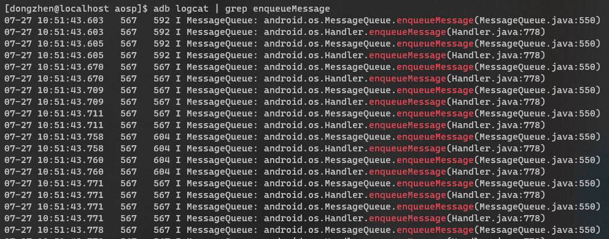
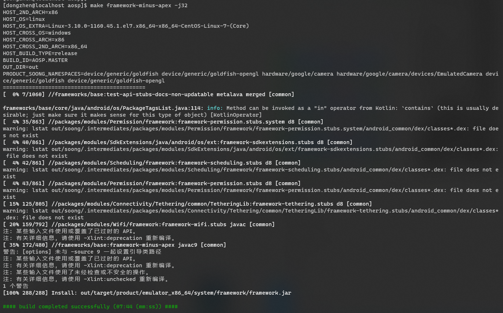
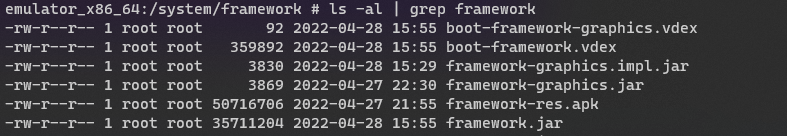
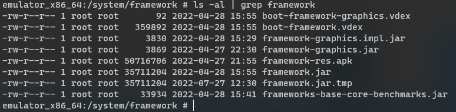
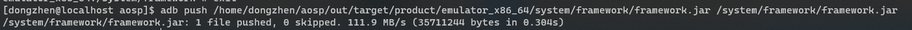
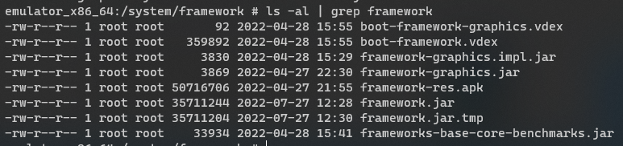
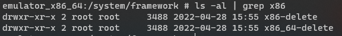
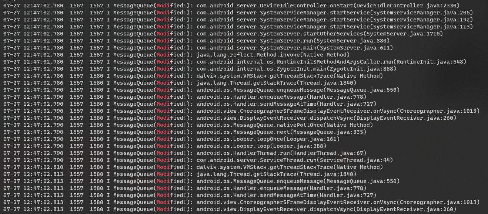

# How to replace framework.jar in AOSP

ABSTRACT: This tutorial gives help to replacing framework.jar in **AOSP 11+**. Recently, I've paid enough to this and finished it narrowly, not for lack of trying. It must be acknowledged that tutorials about building or hacking AOSP on Internet are always out-of-date. Some of them even came out a decade ago! If you followed them (e.g. `make framework`, `emulator` only, `mmm framework/base/core` and so on), you'd win a very disappointing defeat.

TL;DR: It's feasible to **build framework.jar only**, push framework.jar to a running device and **make device use new framework.jar**.

## 1. build AOSP

```shell
> # located at aosp root
> source build/envsetup.sh
>
> # I use x86_64 and you can use some other targets.
> # e.g. arm
> lunch sdk_phone_x86_64
>
> # build aosp literally
> make -j32
```

Then you would get lots of products in `<aosp-root>/out/target/product/emulator_x86_64`, such as `system.img`, `vendor.img`.

For this tutorial, the most important is `<aosp-root>/out/target/product/emulator_x86_64/system/framework/framework.jar`. If you download this file and unzip it, you'd get some \*.dex files instead of various \*.class files. You can find another "framework.jar" in the following paths:

* `out/target/common/obj/JAVA_LIBRARIES/framework_intermediates/classes.jar`
* `out/soong/.intermediates/frameworks/base/framework/android_common/combined/framework.jar`
* `out/soong/.intermediates/frameworks/base/framework-minus-apex/android_common/combined/framework-minus-apex.jar`

I'm using AOSP 11+, so the last file is you need if you'd like to unzip and get *.class files. But `framework.jar` that can do this job is `out/target/product/emulator_x86_64/system/framework/framework.jar`.

## 2. Hack

I chose `<aosp-root>/aosp/frameworks/base/core/java/android/os/MessageQueue.java`. In the past tutorial about [How to share images](https://github.com/skyleaworlder/How-to-share-emulator-from-AOSP), I update this file like [this](https://github.com/skyleaworlder/How-to-share-emulator-from-AOSP/blob/master/aosp/frameworks/base/core/java/android/os/MessageQueue.java#L549):

```java
    boolean enqueueMessage(Message msg, long when) {
        StackTraceElement[] elements = Thread.currentThread().getStackTrace();
        int elementsNum = elements.length;
        for (int i = 0; i < elementsNum; i++) {
            StackTraceElement element = elements[i];
            Log.i(tag, element.toString());
        }
        Log.i(TAG, "");

        if (msg.target == null) {
            throw new IllegalArgumentException("Message must have a target.");
        }

        // ignore some code
    }
```

And it really affects like this:



This time, I update this file to:

```java
    boolean enqueueMessage(Message msg, long when) {
        StackTraceElement[] elements = Thread.currentThread().getStackTrace();
        int elementsNum = elements.length;
        for (int i = 0; i < elementsNum; i++) {
            StackTraceElement element = elements[i];
            String tag = TAG + "(Modified!)";
            Log.i(tag, element.toString());
        }
        Log.i(TAG, "");

        if (msg.target == null) {
            throw new IllegalArgumentException("Message must have a target.");
        }

        // ignore some code
    }
```

I change the input tag of Log.i method.

## 3. Build framework.jar only

In previous AOSP version like Marshmallow, it's recommended to use `make framework` to build a new hacked `framework.jar` by developer. There are still lots of tutorials on personal blogs or answers on St**ck*v*rfl*w using this command `make framework`.

But if you're trying to build `framework.jar` from the newest AOSP you `repo sync` just now, `make framework` won't work because **it doesn't means building framework.jar any longer**. I hope you have some basic knowledge of `Bazel.Build` or `soong Blueprint` and this is an `Android.bp` file under `<aosp-root>/frameworks/base`:

```bp
// This "framework" module is NOT installed to the device. It's
// "framework-minus-apex" that gets installed to the device. Note that
// the filename is still framework.jar (via the stem property) for
// compatibility reason. The purpose of this module is to provide
// framework APIs (both public and private) for bundled apps.
// "framework-minus-apex" can't be used for the purpose because 1)
// many apps have already hardcoded the name "framework" and
// 2) it lacks API symbols from updatable modules - as it's clear from
// its suffix "-minus-apex".
java_library {
    name: "framework",
    defaults: ["framework-aidl-export-defaults"],
    installable: false, // this lib is a build-only library
    static_libs: [
        "app-compat-annotations",
        "framework-minus-apex",
        "framework-appsearch.impl", // TODO(b/146218515): should be removed
        "framework-updatable-stubs-module_libs_api",
    ],
    sdk_version: "core_platform",
    apex_available: ["//apex_available:platform"],
}
```

**It's `framework-minus-apex` that gets installed to the device,** products of target `framework` not installed to the device. But it should be noticed that **the output file's name is still framework.jar**. And you can go to `framework-minux-apex`, you'd see:

```bp
java_library {
    name: "framework-minus-apex",
    defaults: ["framework-minus-apex-defaults"],
    installable: true,
    // For backwards compatibility.
    stem: "framework",
    apex_available: ["//apex_available:platform"],
    visibility: [
        "//frameworks/base",
        // TODO(b/147128803) remove the below lines
        "//frameworks/base/apex/appsearch/framework",
        "//frameworks/base/apex/blobstore/framework",
        "//frameworks/base/apex/jobscheduler/framework",
        "//frameworks/base/packages/Tethering/tests/unit",
        "//packages/modules/Connectivity/Tethering/tests/unit",
    ],
    errorprone: {
        javacflags: [
            "-Xep:AndroidFrameworkBinderIdentity:ERROR",
            "-Xep:AndroidFrameworkCompatChange:ERROR",
            "-Xep:AndroidFrameworkUid:ERROR",
        ],
    },
}
```

You can execute this command and get `framework.jar`:

```shell
> make framework-minux-apex
```



## 4. Push to device

Before push `framework.jar`, you need to run the target device. Inner device of AOSP or each android-virtual-device your created by Android SDK use some environment variables and images.

Pushing `framework.jar` needs 2 shell environments. So if you want to use `emulator` and `adb` provided by AOSP, you can execute these on both:

```shell
> # in aosp-root
> source build/envsetup.sh
> # target is not very important if you only tend to use emulator and adb
> lunch sdk_phone_x86_64
```

The following section might switch between 2 terminals:

```shell
> # shell 1: run your system on emulator
> # -no-window is need unless you're using an OS with GUI
> emulator -writable-system -no-window
```

```shell
> # shell 2: use adb to prepare
> # wait-for-device will exit when device attached,
> #   so you don't need to use "adb devices" often to check status
> adb wait-for-device
>
> adb root
> # disable-verity isn't necessary for your AOSP perhaps,
> #   it disables system to check partitions status
> adb disable-verity
> adb reboot
```

Then you can use `shell` to check files' metadata:

```shell
> # shell 2: use adb to check files
> adb wait-for-device
>
> adb root
> adb shell
> # now in device
> cd system/framework
> ls -al | grep framework
```

You'll get:



Although you use `-writable-system`, your system used by device is read-only still. `remount` can remove the last barrier:

```shell
> # now in device
> exit
> # shell 2: pushing framework.jar
> # make your system writable
> adb remount
> ###############################################################################################
> # if you hate push command would do a uncoverable operation upon your system, it's recommended:
> adb shell
> cd system/framework
> cp framework.jar framework.jar.tmp
> ###############################################################################################
> adb push <aosp-root>/out/target/product/emulator_x86_64/system/framework/framework.jar /system/framework/framework.jar
```





In device:

```shell
> # shell 2: check framework.jar pushed
> adb shell
> cd system/framework
```



## 5. Run

For some reasons, your device won't boot successfully if you use `adb reboot` directly. The last job is to delete `oat` / `<target>` folder under `/system/framework`.

```shell
> # shell 2: delete oat / target
> adb shell
> cd system/framework
> # since I lunch sdk_phone_x86_64, I remove x86 and x86_64
> # you might need to remove arm and arm_64
> # In a nutshell, it all depends
> rm -rf oat x86 x86_64
> ###############################################################################################
> # while I use "mv" instead of "rm -rf", it also work certainly (
> mv oat oat-delete
> mv x86 x86-delete
> mv x86_64 x86_64-delete
> ###############################################################################################
```



Now the only need to do is reboot and logcat:

```shell
> adb reboot
> adb wait-for-device
> adb logcat | grep Modi
```



## Ex.1 About execute path

`framework.jar` is only a library provided for Android developers. If you'd like to customize your `framework.jar` to make it more powerful, you might need to add some config files. Though build system tells us `Properties` is deprecated and not recommended, You can use `System.getProperty` to get `user.dir`:

```java
String dir = System.getProperty("user.dir");
Log.i(TAG, dir);
```

You'll find **"/"**. It means that if your config file `config.xml` is located in `/system/framework`, you need use:

```java
File file = new File("./system/framework/config.xml");
```
